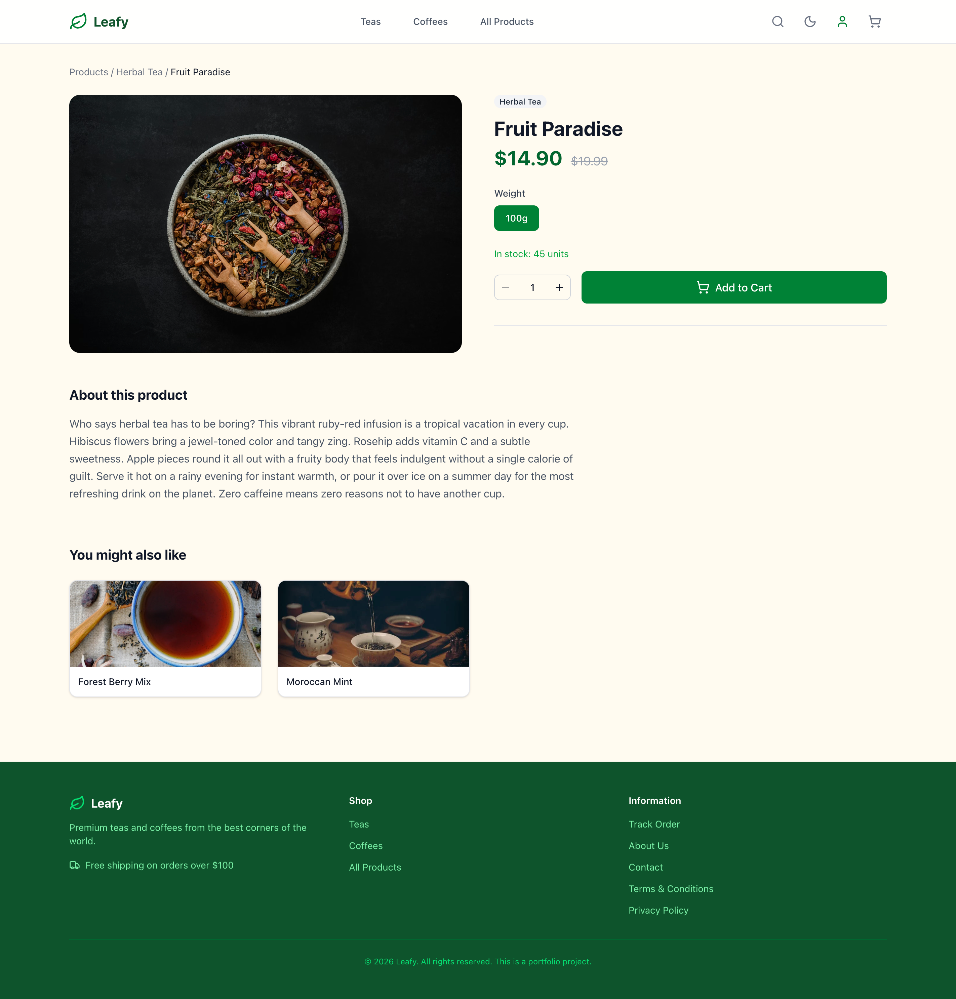
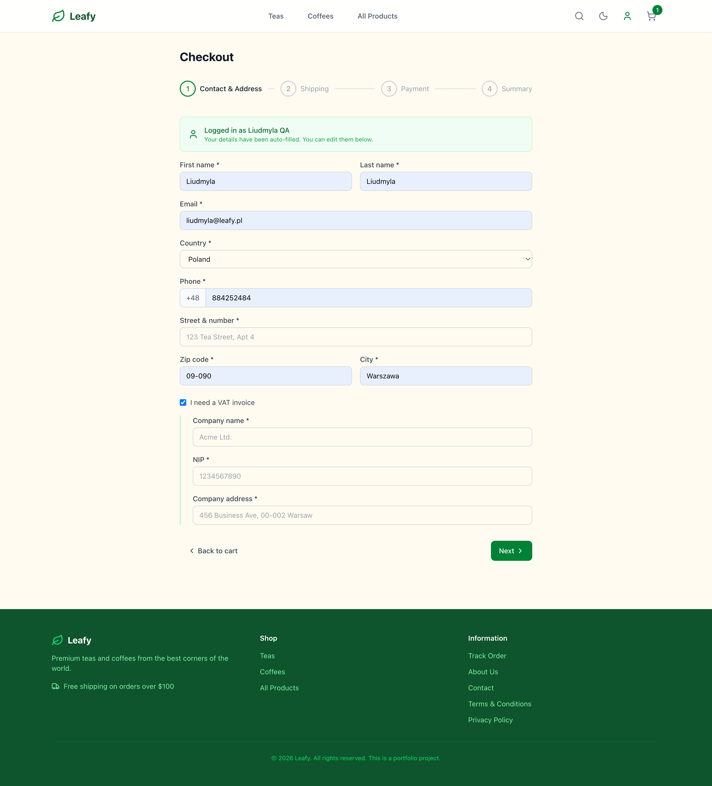
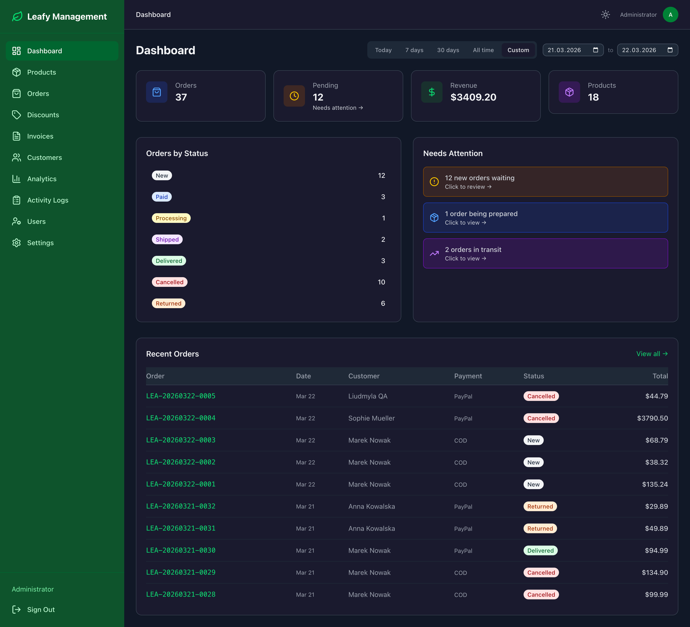
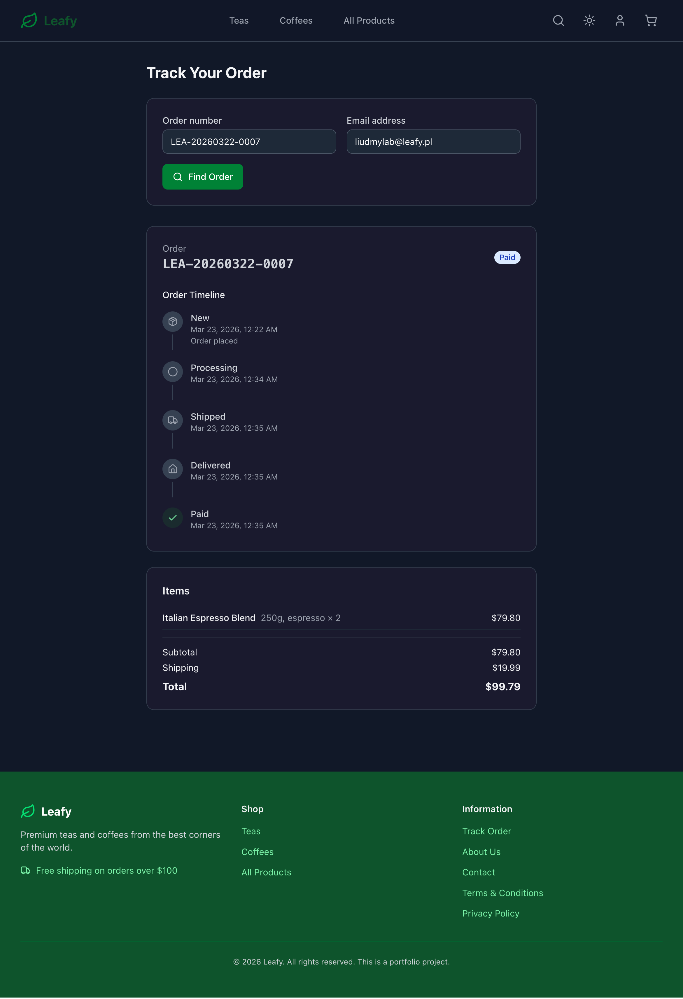
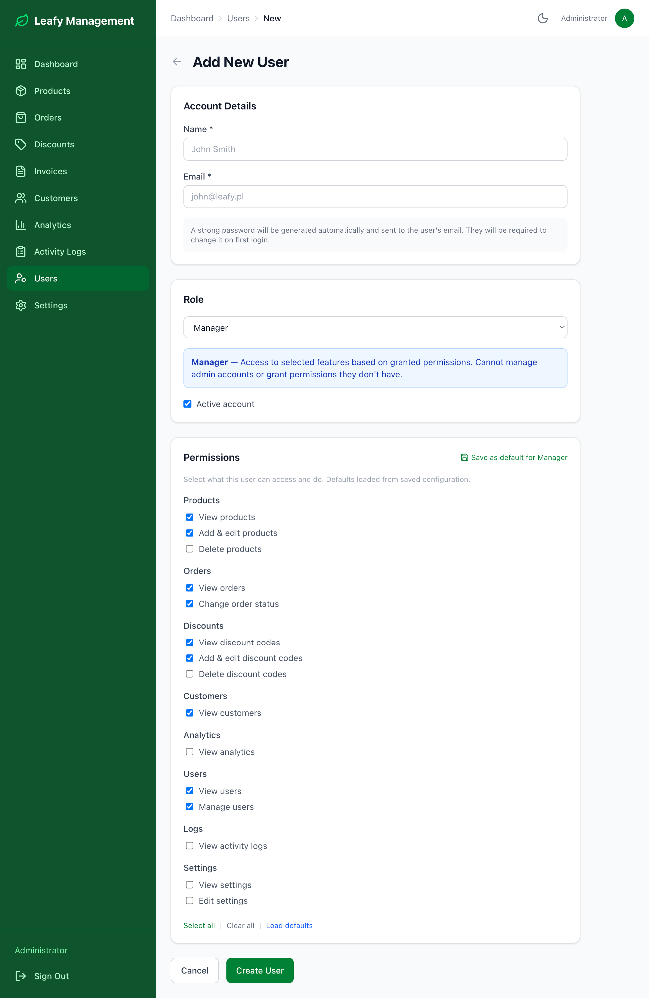
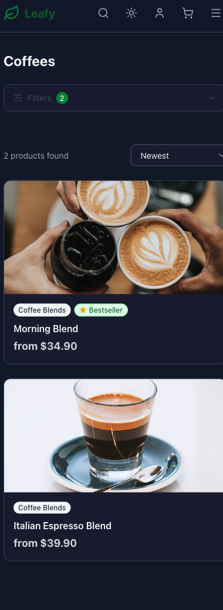
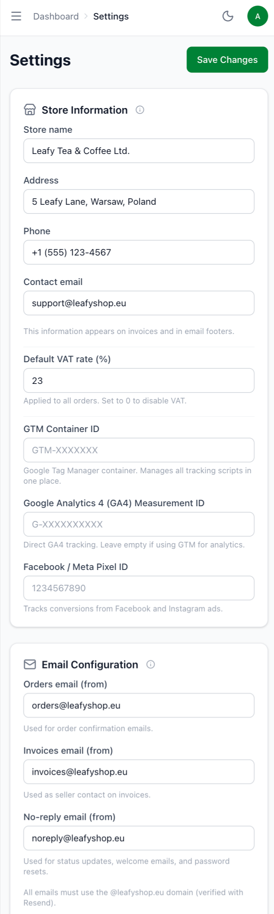

# Leafy Shop

**Full-stack e-commerce built with Next.js 16.2**

[](https://leafyshop.eu)
[](https://www.typescriptlang.org/)
[](https://nextjs.org/)
[](./LICENSE)

A production-ready e-commerce application demonstrating full-stack development with Next.js — complete order flow, PayPal integration, VAT invoices, role-based admin panel, and customer accounts. Built as a portfolio project.

🔗 **Live demo:** [leafyshop.eu](https://leafyshop.eu) · **Admin panel:** [leafyshop.eu/management](https://leafyshop.eu/management)

> ⚠️ Payments run in **PayPal sandbox mode** — no real money is charged. To test a payment, use sandbox credentials generated at [developer.paypal.com](https://developer.paypal.com).
>
> The demo uses a live database — you can place orders, create accounts, and test the full flow. Data is periodically cleaned up.

---

## Screenshots

<table>
  <tr>
    <td align="center" width="50%">
      
      <br><b>Product catalog</b> — filters, sorting, search
    </td>
    <td align="center" width="50%">
      
      <br><b>Product page</b> — variants, stock, related products
    </td>
  </tr>
  <tr>
    <td align="center">
      
      <br><b>Checkout</b> — multi-step with country validation
    </td>
    <td align="center">
      
      <br><b>Admin dashboard</b> — stats, orders, alerts (dark mode)
    </td>
  </tr>
  <tr>
    <td align="center">
      
      <br><b>Order tracking</b> — timeline, status history
    </td>
    <td align="center">
      
      <br><b>Users</b> — granular role-based permissions
    </td>
  </tr>
  <tr>
    <td align="center">
      
      <br><b>Mobile</b> — responsive product catalog
    </td>
    <td align="center">
      
      <br><b>Settings</b> — fully responsive admin panel
    </td>
  </tr>
</table>

---

## Features

### Storefront
- Product catalog with filters (type, category, availability), sorting, and full-text search
- Product pages with variants (weight, grind type for coffees)
- Shopping cart with discount codes and shipping cost calculation
- 4-step checkout: contact info → shipping → payment → summary
- Country-specific validation (phone prefix, zip format, tax ID)
- 3 shipping methods: DPD courier, InPost parcel locker, in-store pickup
- PayPal payments (sandbox) and cash on delivery (COD)
- VAT invoices with net/gross breakdown
- Order tracking by number and email
- Dark mode with preference persistence
- Fully responsive (mobile / tablet / desktop)

### Customer accounts
- Registration and login
- Profile — edit personal data, shipping address, change password, delete account
- Order history with invoice download
- Password reset via email
- Auto-fill checkout data when logged in

### Admin panel (`/management`)
- **Dashboard** — order stats, revenue, items needing attention, date range filters
- **Products** — CRUD with variants, images, badges; CSV import/export
- **Orders** — status management with timeline, tracking numbers, internal notes
- **Discounts** — percentage, fixed amount, free shipping codes; usage limits, expiry dates, category restrictions
- **Invoices** — HTML generation with company details, preview and print
- **Customers** — accounts list with order history, full data editing, password reset links, duplicate detection
- **Analytics** — revenue, margin, top products, charts by period
- **Activity Logs** — audit trail of all operations, filters, pagination
- **Users** — roles (Admin / Manager / Tester), granular per-section permissions
- **Settings** — store info, VAT rates, email templates, categories, badges, GTM / GA4 / Facebook Pixel

### Role-based permissions
| Role | Access |
|------|--------|
| **Admin** | Full access to all features |
| **Manager** | Access based on individually granted permissions |
| **Tester** | Test mode — sees own data marked as test, auto-cleaned after session |

---

## Tech stack

| Layer | Technology |
|-------|-----------|
| Frontend | Next.js 16.2 (App Router), React, TypeScript, Tailwind CSS 4 |
| State | Zustand (cart store) |
| Backend | Next.js API Routes, Drizzle ORM |
| Database | PostgreSQL (Neon) |
| Payments | PayPal REST API (sandbox) |
| Email | Resend |
| Hosting | Vercel |
| Auth | JWT (jose), bcryptjs |

### Key architectural decisions
- **Drizzle ORM over Prisma** — better edge runtime support, no client generation on migrations
- **Neon PostgreSQL** — serverless Postgres with built-in connection pooling, ideal for Vercel
- **Prices in cents (integer)** — avoids floating-point precision issues in financial calculations
- **Two-step PayPal checkout** — order created first, then captured after payment (prevents duplicates)
- **JWT over NextAuth** — separate tokens for admins and customers, full control over sessions and permissions
- **Resend over Nodemailer** — reliable email delivery without managing an SMTP server

### Project structure
```
src/
├── app/           # Pages (App Router) + API routes
├── components/    # UI, layout, admin, products
├── constants/     # Countries, shipping, permissions, links
├── lib/           # DB, auth, email, PayPal, validators, utils
├── store/         # Zustand (cart)
└── types/         # TypeScript types
```

---

## Security

- Input validation (Zod) on all API endpoints
- HTML escaping in invoices — XSS protection
- Rate limiting on login and sensitive endpoints
- Granular permission checks at API level
- Atomic stock checks — prevents overselling on concurrent orders
- Order ownership verification on PayPal capture
- Tracking ID format validation before DOM injection

---

## Local development

```bash
git clone https://github.com/LiudmylaBondarchuk/Leafy-shop.git
cd Leafy-shop
npm install
cp .env.example .env.local
# Fill in the variables in .env.local
npm run dev
```

### Required environment variables

| Variable | Description |
|----------|------------|
| `DATABASE_URL` | PostgreSQL connection string (e.g. Neon) |
| `JWT_SECRET` | Secret for admin panel JWT tokens |
| `CUSTOMER_JWT_SECRET` | Secret for customer JWT tokens |
| `NEXT_PUBLIC_PAYPAL_CLIENT_ID` | PayPal Client ID (sandbox) |
| `PAYPAL_CLIENT_SECRET` | PayPal Client Secret (sandbox) |
| `RESEND_API_KEY` | Resend API key (email) |

Full list of variables in `.env.example`.

---

## Test mode (admin panel)

The admin panel provides a tester account with limited permissions:
1. Go to `/management/login`
2. Select the **Tester** tab
3. Click **Generate Test Password**
4. Log in — test data is automatically cleaned up after the session

---

## License

[MIT](./LICENSE)
